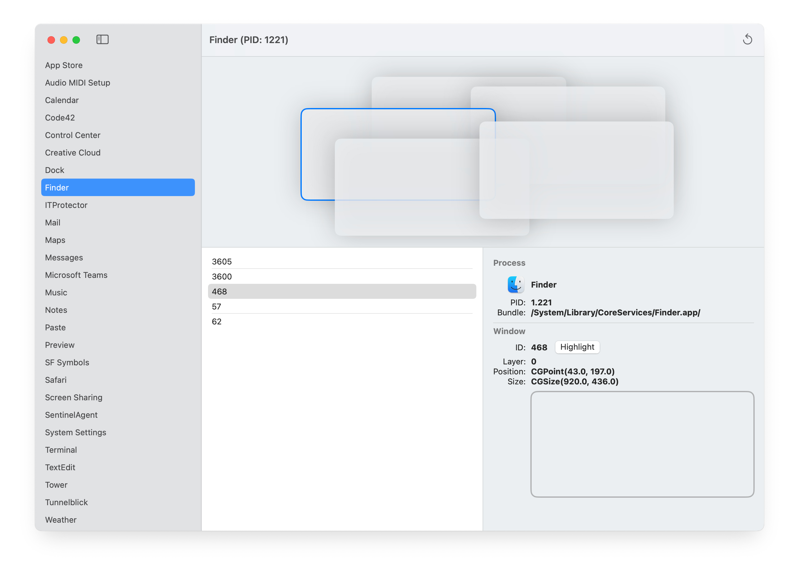

# WhatWindow

Ever worry that a shady app might pop up a window that looks legitimate but isn’t? **WhatWindow** cuts through the disguise: it instantly tells you which running process owns each window on your screen, so you can spot impostors and stay safe.

**Features**:

- List all windows grouped by process
- Give a visual preview of the listed windows
- Show an overlay on your screen that highlights the actual window

**Technologies**:

- [Quartz Window Services](https://developer.apple.com/documentation/coregraphics/quartz_window_services)
- SwiftUI
- Cocoa